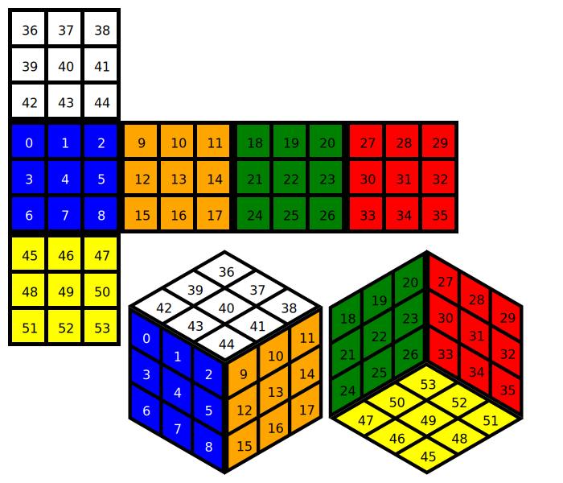

# Rubik's Cube Microservice

This is a small microservice designed to simulate a Rubik's Cube and either solve or perform basic rotations.

When app.py is run, Flask binds to port 8080 and ties multiple paths to different functions:
- '/' (root): displays welcome information
- '/about': displays author name (me!)
- '/rubik': subdirectory for original Rubik's Cube processes
  - '/rotate': supplied with up to 2 parameters, 'cube' (required) and 'dir' (optional)
    - extraneous keys, missing or invalid-formatted cube, or invalid dir result in error returned to user
    - if not supplied with 'dir', will treat it as if a single 'F' rotation
    - displays a dict featuring a status code and the resultant cube string if status is 'ok', otherwise a dict with status detailing the error
  - '/solve': supplied with 1 parameter, 'cube'
- '/rubik_redux': subdirectory for revamped Rubik's Cube processes
  - '/rotate': supplied with up to 2 parameters, 'cube' (required) and 'dir' (optional)
    - extraneous keys, a missing, invalid, or unsolvable cube, or an invalid dir results in error returned to user
    - will perform no rotations if not supplied with 'dir' parameter
    - displays errors in string form, or if no error then will display a dict with status of 'ok' and the resultant cube string
  - '/solve': supplied with up to 2 parameters, 'cube' (required) and 'style' (optional)
    - extraneous keys, a missing, invalid, or unsolvable cube, or an invalid style results in error returned to user
    - style defaults to 'classic'
    - all styles will result in a solved cube, and are differentiated by the 'method'
      - 'classic': a 'traditional' solve performed in 5 stages: bottom cross, bottom layer, middle layer, top cross, top layer

'cube' specification:
- 54 character long string
- Allowed characters: lowercase a-z, uppercase A-Z, digits 0-9
- Center points must be unique
- Pieces have to match one of the center points
- There has to be 9 of each piece
- Cube string is laid out to correspond to the following (character at position X corresponds to piece labeled X)
- ex: solved cube can be bbbbbbbbbooooooooogggggggggrrrrrrrrrwwwwwwwwwyyyyyyyyy, or aaaaaaaaa000000000ZZZZZZZZZlllllllllFFFFFFFFFjjjjjjjjj

# Why and How this was made

This was originally made as a semester long project done for a class, which I'm going to be polishing and cleaning up to be presentable in an out-of-class context.

As of initial commit, the only changes since its use in the class has been updating names and refactoring the SBOM.

We were given the overall premise at the start of the course, to perform weekly updates to this microservice to fit added specification such as solving additional layers of the cube, in a TTD manner using 'Red Light' and 'Green Light' commits.
1. Red Light: write tests to the specifications, ones that you expect to fail
  - If they don't fail, figure out why.
2. Green Light: fill out live code to pass the test cases
  - If they don't pass, figure out why, and update the product code until they all pass.

